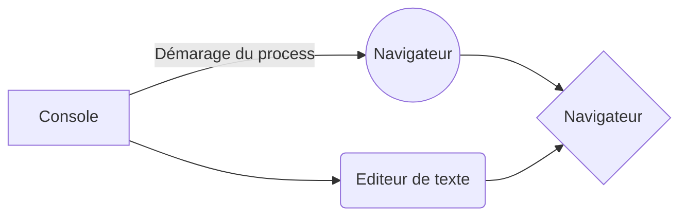

# Dossier OCRStudent

### Par Wispelaere Anthony Développeur Front-end

## Présentation de diverses méthodes de travail

- Dossier taskRunnerGulp : "Démonstration d'une mise en place d'un task runner utilisant npm pour son installation et gulp pour son fonctionnement"

Schéma de son fonctionnement :

